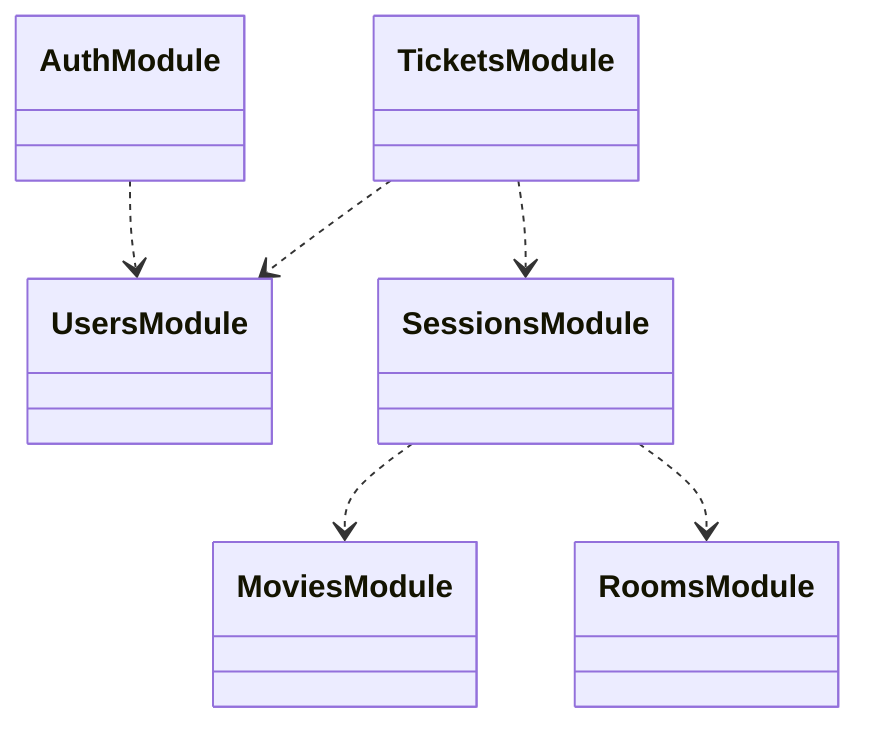

# Application Design

## Story

In the defined business domain:

-  Add (Register) Users: There are two types of users, managers and customers. Users
have an email, password, and age info.
-  Login: The user will log in using email and password.
-  Add Movie: Only managers can perform this operation. Movies have a name, sessions,
and age restriction info. Sessions consist of the date, room no, and time slot info.
Ex. Name: My Movie, Sessions: [{Date, Time Slot, Room No}, {...}, …], Age: 13
Assume that time slots are constant. (10.00-12.00, 12.00-14.00, …, 22.00-00.00)
- List Movies: All users can perform this operation.
- Delete Movie: Only managers can perform this operation.
- Modify Movie Info: Only managers can perform this operation.
- Buy Ticket: Consider age restriction for this operation.
- Watch Movie: The user can watch a movie if s/he has a valid ticket for that session. The
service should return a successful response.
    - If the user gets a successful response, You should create a record entry
consisting of [user, movie, date]
- List Watched Movies: The user can see the list of movies s/he has watched before

## Extracted Terms

- Room: Is a physical location where movies are shown, with a specific capacity
- Movie: Is a movie that can be watched with a minimum age restriction
- Session: Is a 2 hours period, a movie that is shown in a room at a specific time
- Ticket: Is a ticket that is bought by a user to watch a movie in a session
- Manager: Is a person who can add rooms and movies, and create sessions

## Key Scenarios

Actors:

- Manager: Admin user who can modify the most of the entities
- User: Customer user who can buy tickets, and watch movies

We can target the key scenarios as follows:

Session creation:

- Manager adds a room
- Manager adds a movie
- Manager creates a session with a movie and a room, for a specific date and time slot
- Manager cannot create a session for a room, date and time slot that is already scheduled

Ticket creation:
- User lists movies
- User picks a movie a lists sessions
- User picks a session and buys a ticket
- User cannot buy a ticket for a session that at full capacity
- User cannot buy a ticket for a session with an age restriction that is not satisfied

Ticket usage:
- User uses a ticket to watch a movie in a session
- Ticket becomes a used ticket

Listing watched movies:
- User could list his/her tickets

## Domain Model

With extracted scenarios, we can define the domain model with the following entities:

- Room Entity: Physical location model with a name, and capacity
- Movie Entity: Movie model with a name, age restriction
- Session Entity: Session model with a movie, room, date, and time slot
- Ticket Entity: Ticket model with a user, session, and status
- User Entity: User model with an email, password, and age info

I have preferred to use different modules/services for each entity, and a module for authentication. In a NestJS application we can leverage the module system to encapsulate the domain modules.

- All modules will encapsulate their own domain model, and business details. Service layer will be responsible for the business logic.
- We can integrate the modules at service layer.
- We will not use a shared database between the modules, we will not use entity restrictions which references to other entities.
- One module could inject the required module for its service layer.
- In the future, we can further decouple the modules in necessary conditions. We can use extract new services from the existing modules.

We can represent the domain model with the following relation diagram:

### RoomsModule

Will be responsible for CRUD operations for room entity.

### MoviesModule

Will be responsible for CRUD operations for movie entity.

### SessionsModule

Will be responsible for CRUD operations for session entity.

- Two session entities cannot exist with the same room, date, and time slot.

### TicketsModule

Will be responsible for CRUD operations for ticket entity.

- A ticket cannot be created for a session that is full, or has an age restriction that is not satisfied by the user.

## Technical Design

### Service Framework, NestJS

Parts of Nest

- Controllers: Handle incoming requests
- Services: Handles data access and business logic
- Modules: Groups together code
- Pipes: Validates incoming data
- Filters: Handles errors that occur during request handling
- Guards: Handles authentication
- Interceptors: Adds extra logic to incoming requests or outgoing responses
- Repositories: Handles data stored in a DB

We will use the NestJS as our main service framework.  It provides a great foundation for applications. It provides a module system, dependency injection, and a solid middleware system natively.

In this application:

- We will separate our domain to isolate our modules.
- We will use the service layer for the business logic.
- We will use the controllers for the incoming requests.
- Se will use the guards for the authentication and role policy checks.
- We will use the interceptors for the logging.
- We will use TypeORM for the database access.

There are multiple use cases for the interceptors. We can intercept the incoming requests, and outgoing responses. We can use the interceptors to mask the sensitive data, or to log the incoming critical requests.

NOTE: At the current implementation app contain exception throwing part in the controllers. This is not the best practice, we are using the Express for our HTTP client, and it could handle the occurring exceptions and return the proper response. In future if we use our service classes with different connection types we could consider using an exception filter for better handling.

### Endpoint Design

We will use the NestJS capabilities to regulate our endpoints. We will explicitly define the endpoint payload DTO structures and parameters.

For each module we will support CRUD operations in a RESTFUL manner:

- We will provide a POST endpoint for create.
- We will provide a GET endpoints for individual record retrieval, and list retrieval.
- We will provide a PATCH endpoint for update.
- We will provide a DELETE endpoint for delete.

### Cyclic Dependency Cases

Current implementation does not contain any cyclic dependency relations. We need to avoid cyclic dependencies between modules. If one module depends on another module, and other module depends on the first module we have a cyclic dependency case, and possibly we should review the module design.

Currently we have a linear dependency chain between the modules, initial diagram points the relations. But if we face more complex business rules, for example currently we are not applying any restrictions for room or movie deletion, we could face a cyclic dependency case between our current modules. In this scenario we could consider extracting a new module and service. Still we have the forward ref option for cyclic dependency cases as a last resort.

### TypeORM, Entities

I have selected the TypeORM as the common ORM for all modules. TypeORm is a popular ORM for Node.js applications. It provides isolation from the underlying database technology. We can use the same entities on different databases. Additionally, we will utilize the in memory database for the e2e tests.

If we repeat the isolation principle for modules we will not use any cross entity references. We will not use any foreign key constraints. Similar constraints will be implemented at the service layer. Our individual entities will be only responsible for their own entity.

For better reliability we will introduce several constraints at the database level:

- User table will apply a unique constraint for the email column.
- Session will apply a unique constraint for the room, date, and time slot columns.

For several cases we will consider using indexing for better performance, but we should avoid premature optimization. We can plan the optimization steps with metrics.

NOTE: Our entities are taking the auto generated ids from the database. We could consider using uuids for better security.

### Authentication

For application authentication, we will use JWT (JSON Web Token) authentication. We will use a JWT token to authenticate the user after login. This app will not provide the full functionality of a real-world authentication system. For the guard strategies we will use passport.js module.

Passport.js is a popular authentication middleware for Node.js. We will use passport.js local strategy for authentication, in long term we can extend the authentication system with other strategies like oauth2, or social media authentication.

- App will not use refresh tokens, and we will not use a blacklist for the tokens.
- App will not use a password policy.
- App will not use a password reset, change, recovery functionality.
- App will not use a password expiration.
- App will not support oauth2 federated authentication with social media accounts.

On the user registration, we will use bcrypt.js module to hash the password.

NestJS provides the guard system to protect the endpoints. We will require the user to be authenticated for the endpoints that require authentication. We will use JwtAuthGuard for this purpose.

### Role Policy

We have two types of users, managers and customers. App will use a role policy to restrict the access to the endpoints.

At the user registration, we are accepting the user role as a parameter, this behavior is not realistic for a real-world application.

Currently, we don't have defined user leveraging mechanism. For our app we can consider migrating the initial admin user with a prod migration and with the initial admin manager we can change the role of the users, can create new managers.

For role policy control we will use API endpoint decorators. We will use @Roles decorator to restrict the access to the endpoints. We will use RoleGuard to protect the endpoints.

### Unit Tests with Jest, E2E Tests with Supertest

I have created unit tests for movies, rooms, session modules. Unit tests are based on the Jest framework. For unit testing strategy spec files are located next to the source files, they will contain the layer behavior tests.

Service layer tests will be only responsible for the business logic. We will mock the repository layer for the service layer tests. If we use other modules in the service layer, we will mock them too. By this way we could test the service layer in fine isolation. Same principle is also applied to the controller layer. For this case we will mock the related service classes. NestJS provides great flexibility with the help of native dependency injection system.

For the e2e test current implementation provides one sample with rooms.e2e-spec.ts, this test suite provides a concept for the in memory e2e tests, we have 2 env configurations. On the test file we can see the Sqlite in memory database configuration. During the e2e test suites will start with a fresh database and we will follow the use cases with API calls. In memory database will be destroyed after the test suite execution.

Large unit test suites and e2e test suites could be slow. In extreme cases it could slow down the CI/CD pipeline. We can consider using parallelization for the test suites in necessary conditions. Yet again at the beginning we should avoid premature optimization. Additionally, very large test suites could be a sign of bad design. Usually they are the product of a monolith.

### Environment Variables

We are using 2 env configurations, one for dev and one for test. They have very limited information at the current form because we don't use any additional AOI integrations or cloud services. Currently app is deployed on the Heroku, app's prod env variables are configured on the Heroku project.

### Swagger

Whole API is documented with Swagger. We can access the Swagger UI from the /api endpoint. For all API endpoints app has the documentation for payload schemas, and parameters. For further development we can consider adding the response schemas too. NestJS provides integration with the Swagger module, we can see the DTO classes on the Swagger UI. Still it requires minimal configuration with decorators to provide the full functionality.

On the swagger interface all authenticated endpoints are marked with a lock icon. We can use /login endpoint to get token, we need that token to test other endpoints.  
