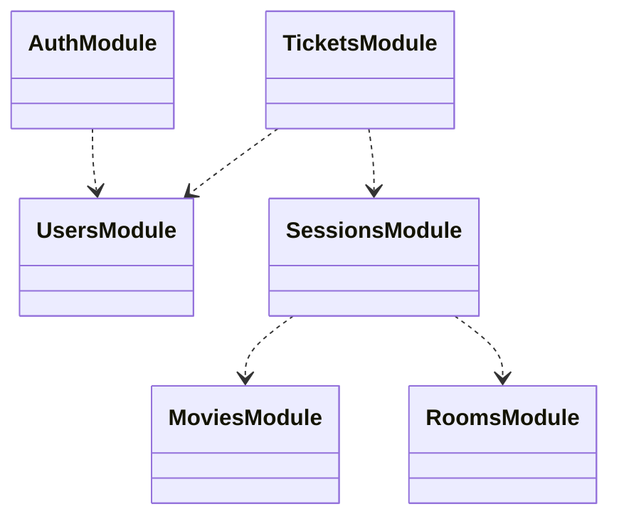

# Technical Design

## Domain Model

In the defined business domain:

-  Add (Register) Users: There are two types of users, managers and customers. Users
have an email, password, and age info.
-  Login: The user will log in using email and password.
-  Add Movie: Only managers can perform this operation. Movies have a name, sessions,
and age restriction info. Sessions consist of the date, room no, and time slot info.
Ex. Name: My Movie, Sessions: [{Date, Time Slot, Room No}, {...}, …], Age: 13
Assume that time slots are constant. (10.00-12.00, 12.00-14.00, …, 22.00-00.00)
- List Movies: All users can perform this operation.
- Delete Movie: Only managers can perform this operation.
- Modify Movie Info: Only managers can perform this operation.
- Buy Ticket: Consider age restriction for this operation.
- Watch Movie: The user can watch a movie if s/he has a valid ticket for that session. The
service should return a successful response.
    - If the user gets a successful response, You should create a record entry
consisting of [user, movie, date]
- List Watched Movies: The user can see the list of movies s/he has watched before

## Extracted Terms

- Room: Is a physical location where movies are shown, with a specific capacity
- Movie: Is a movie that can be watched with a minimum age restriction
- Session: Is a 2 hours period, a movie that is shown in a room at a specific time
- Ticket: Is a ticket that is bought by a user to watch a movie in a session
- Manager: Is a person who can add rooms and movies, and create sessions

## Key Scenarios

Session creation:

- Manager adds a room
- Manager adds a movie
- Manager creates a session with a movie and a room, for a specific date and time slot
- Manager cannot create a session for a room, date and time slot that is already scheduled

Ticket creation:
- User lists movies

